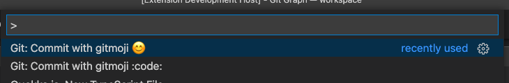

# gitmoji-dev

An emoji guide for your commit messages

## Usage

1. Open command pallete
2. Type: `Git: Commit with gitmoji` or just `gitmoji`

## Features

- [x] Select emoji from [gitmoji.dev](gitmoji.dev)
- [x] Commit with emoji symbol 😊
- [x] Commit with emoji :code:
- [x] Commitment without useless effort
